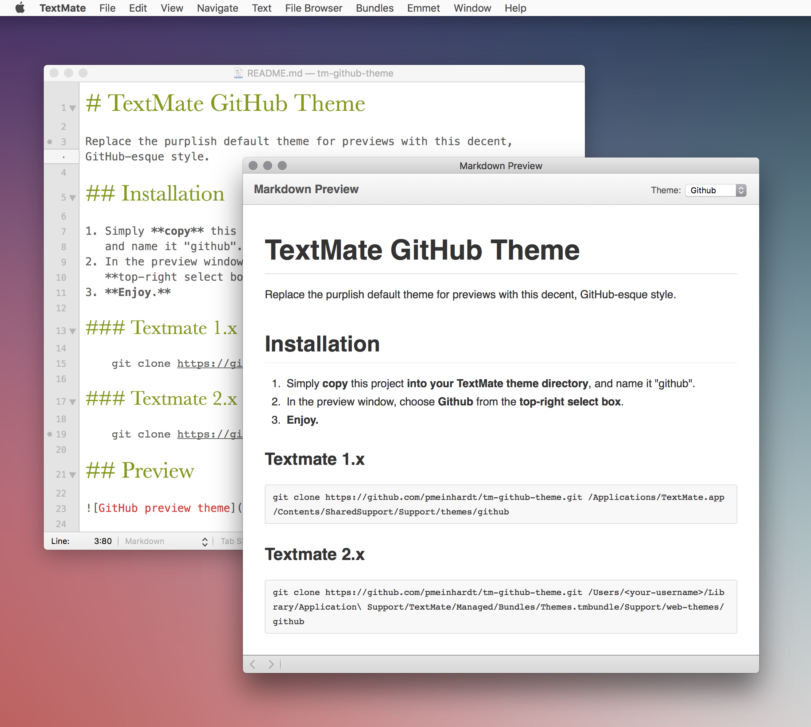

# TextMate GitHub Theme

Replace the purplish default theme for previews with this decent, GitHub-esque
style.

## Installation

1. Simply **copy** this project **into your TextMate theme directory**,
   and name it "github".
2. In the preview window, choose **Github** from the
   **top-right select box**.
3. **Enjoy.**

### Textmate 1.x

    git clone https://github.com/pmeinhardt/tm-github-theme.git /Applications/TextMate.app/Contents/SharedSupport/Support/themes/github

### Textmate 2.x

    git clone https://github.com/pmeinhardt/tm-github-theme.git /Users/pmeinhardt/Library/Application\ Support/TextMate/Managed/Bundles/Themes.tmbundle/Support/web-themes/github

## Preview

## Notice

Styles are derived from the [GitHub](https://github.com) markdown-body styles.
